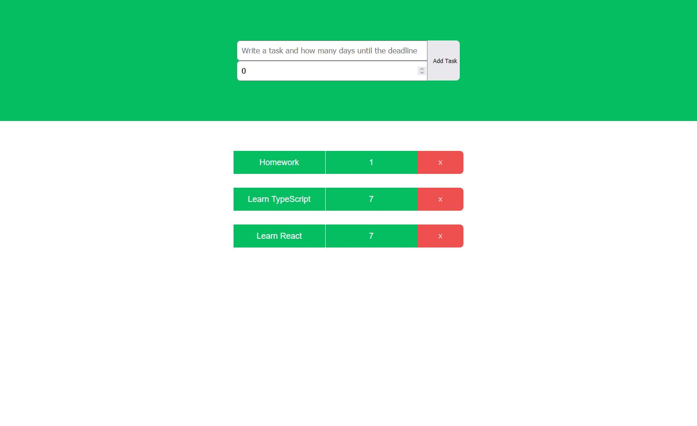

# Simple To-Do List App using ReactJS & TypeScript. Technical Case Study

## Objective
A Simple To-Do List App demonstrates that TypeScript is not limited to Angular or plain JavaScript projects; we may also use it in ReactJS projects. Typescript provides the tools to define strict types for ReactJS components, props, states, and event handlers.

## User Stories
- As a user, I should be able to add a task on To-Do list
- As a user, I should be able to delete a task on the To-Do list after completion
- As a web developer, I should be able to define strict types for ReactJS components, props, states, and event handlers using Typescript.

## Technical Requirements & Solutions
- The application must be built using ReactJS with TypeScript
- The application must use types and interfaces provided in TypeScript
- The application must declare types for states and props in functional or class base components
- The application must use event types in React
- The application requires the latest version of Node.js and npm package
- The project's code must be hosted on GitHub

## Key Features
- Add items to the To-Do list
- Delete items from the To-Do list after completion.

## How to create a React App with TypeScript
This project was bootstrapped with [Create React App with TypeScript](https://create-react-app.dev/docs/adding-typescript/).

## Available Scripts
In the project directory, you can run:

### `npm start`
Runs the app in the development mode.\
Open [http://localhost:3000](http://localhost:3000) to view it in the browser.

The page will reload if you make edits.\
You will also see any lint errors in the console.

### `npm test`
Launches the test runner in the interactive watch mode.\
See the section about [running tests](https://facebook.github.io/create-react-app/docs/running-tests) for more information.

### `npm run build`
Builds the app for production to the `build` folder.\
It correctly bundles React in production mode and optimizes the build for the best performance.

The build is minified, and the filenames include the hashes.\
Your app is ready to be deployed!

See the section about [deployment](https://facebook.github.io/create-react-app/docs/deployment) for more information.

### `npm run eject`

**Note: this is a one-way operation. Once you `eject`, you can’t go back!**

If you aren’t satisfied with the build tool and configuration choices, you can `eject` at any time. This command will remove the single build dependency from your project.

Instead, it will copy all the configuration files and the transitive dependencies (webpack, Babel, ESLint, etc.) into your project to have full control over them. All of the commands except `eject` will still work, but they will point to the copied scripts so you can tweak them. At this point, you’re on your own.

You don’t have ever to use `eject`. The curated feature set is suitable for small and middle deployments, and you shouldn’t feel obligated to use this feature. However, we understand that this tool wouldn’t be helpful if you couldn’t customize it when you are ready for it.

## Learn More
You can learn more in the [Create React App documentation](https://facebook.github.io/create-react-app/docs/getting-started).

Check out the [React documentation](https://reactjs.org/) to learn React.

## Simple To-Do List App using ReactJS & TypeScript screenshot

